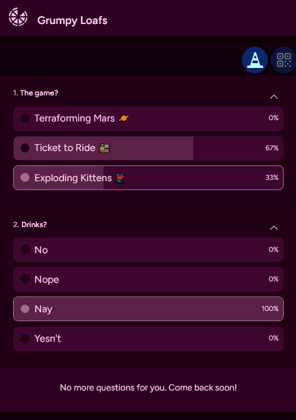

# Party Poll


## About
Quickly ask your friends about anything 🍕🪩🎵🎄 

**This project is in early development**, most of the features are yet to be 
fully functional.

## Features
- 🔗 Invitation-based - hop in with link or QR Code. 
- 👑 Prepare your master questions and release them when they're ready. 
- ✨ Came up with new ideas? Add some more questions later, everybody will get notifications to check out the poll.
- 👽 No need for registering accounts, just type your name - or don't. Lorem-ipsum names are underrated ✌️
- 🏀 It's real-time!



## Installation

```
composer install
npm install
php artisan reverb:install
```

Single container Docker version is planned

## Running

```
php artisan reverb:start
php artisan queue:work 
```

## Stack
- PHP8.2
- Laravel 11
- Vue 3.4 bridged with InertiaJS
- Laravel Echo for realtime updates
 